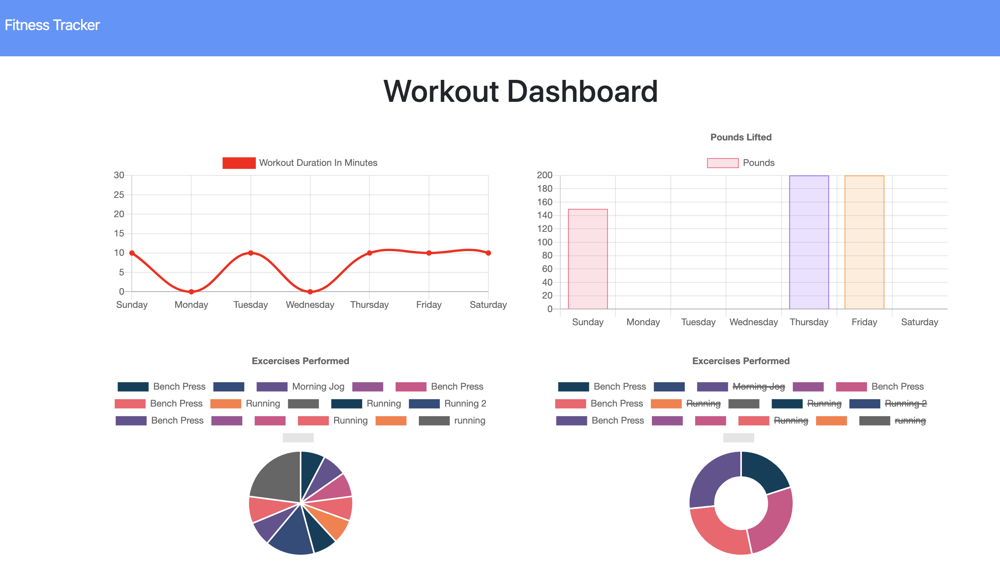

# HW17-Fitness-Tracker
My submission for the HW17-Fitness-Tracker assignment.

1) Description: This application uses the MongoDB program and the Mongoose schema to manage the user's daily workout routine.  It creates and tracks daily workouts, logs multiple workouts for a given day, and tracks the name, type, weight, sets, reps, and duration of exercise.

2) Link to deployed application: https://bkim377.github.io/HW17-Fitness-Tracker

3) Screenshot: 